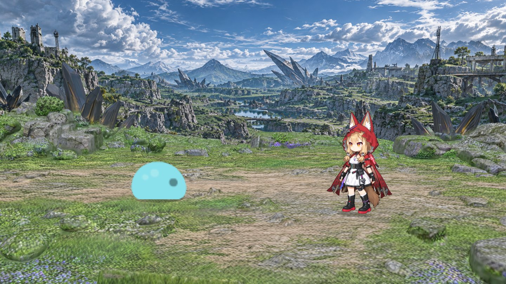
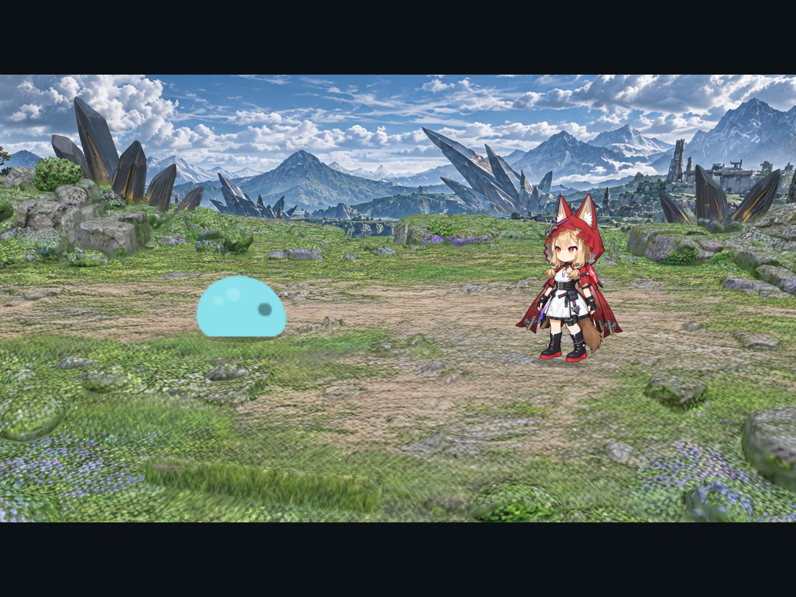
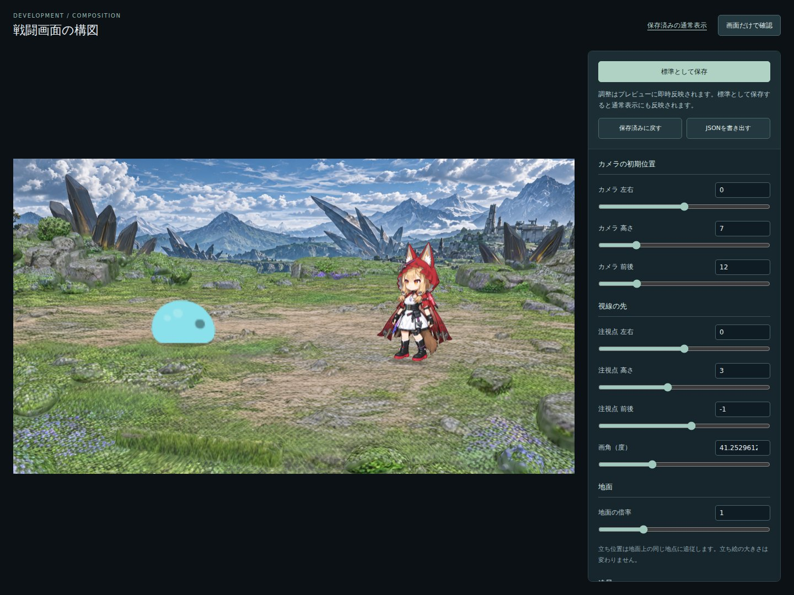
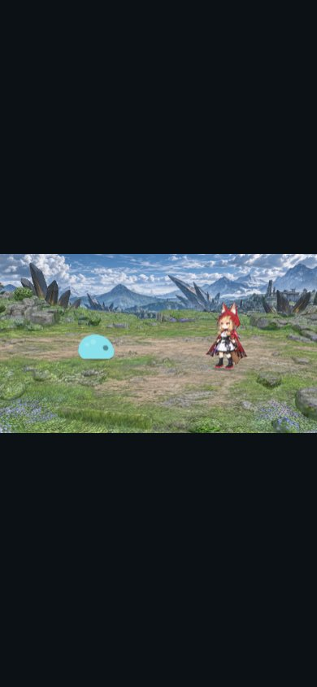

# 戦闘画面と構図設定

Issue [#4](https://github.com/karin0624/endfield_rpg/issues/4)・[#5](https://github.com/karin0624/endfield_rpg/issues/5)・[#8](https://github.com/karin0624/endfield_rpg/issues/8)・[#9](https://github.com/karin0624/endfield_rpg/issues/9)で、地面・遠景・固定2対2編成の表示と、戦闘コアに接続した通常攻撃画面を実装した。ユーザーは地面モデルと遠景画像の組み合わせごとに暫定の標準構図を決める。現在は1フィールド分を扱う。Babylon.jsは`src/web/`に閉じ、ゲーム状態にメッシュ・テクスチャ・カメラを入れない。戦闘ルールは[戦闘仕様](battle.md)、UIの配色・状態表現は[デザインガイドライン](design-guidelines.md)を参照する。

## 通常画面と開発用の設定画面

| 表示 | 開き方と役割 |
| --- | --- |
| 通常画面 | `/`。保存した構図で16:9の戦闘画面を表示。画面の縦横比に応じて余白を設け、構図を保つ |
| 構図設定 | `npm run dev`で`/?edit=1`。右上の「構図設定」からも入れる。数値入力・スライダーを動かすと即座に描画へ反映 |
| 画面だけで確認 | 設定画面のボタンで操作パネルを隠し、編集中の構図を通常表示と同じ大きさで確認。「設定に戻る」で編集を続ける |
| 配布用ビルド | 保存したJSONの構図を使う。設定UI・設定画面へのリンク・保存APIを含めない。`?edit=1`も無視する |

## 通常画面の戦闘UI

戦闘UIは16:9の盤面上に重ねて表示する。デスクトップでは盤面の大きさに合わせてUIも拡大し、文字・操作部品に読みやすい最小寸法を保つ。幅900px以下では16:9の戦闘ステージを先頭に置き、操作UIをその下に縦積みする。基準寸法は1308×728pxで、画面寸法を固定するものではない。実表示サイズで文字、敵との重なり、横スクロールの有無を確認する。

| 領域 | 配置・表示内容 |
| --- | --- |
| 行動順 | 左端の縦リスト。顔アイコンと次の行動までの残り整数tickを表示する。現在の行動者は枠と暗い面で示し、現在行の0値や「行動中」の文字は表示しない。tickの意味は[戦闘仕様](battle.md)に従う |
| コマンド | 右端の縦リスト。通常攻撃を配置し、味方の入力待ちでない間と演出中は操作を無効にする |
| 一時情報 | 上中央の通知。攻撃・戦闘不能・勝敗を順に表示し、同時に重ねない。表示内容がないときは隠す |
| 味方の状態 | 下部右寄せ。カードは幅230×高さ78px、間隔10pxを基準とし、味方が増えたら左へ展開する。現在の行動者は枠と暗い面で示す |
| 敵の状態・対象 | 敵の名前とHPを敵の上に表示し、選択中の敵にはさらに上側に四面体マーカーを置く。生存中の敵をクリックすると対象を切り替える。同じ敵を再クリックしても選択は解除しない。初期対象と選択対象が倒れた後の対象は、画面上でカメラに近い生存敵から決める。名前札とマーカーは敵の絵を覆わない |

敵の撃破演出後は、その敵の画像・名前札・クリック領域を隠す。残った敵は開始時の位置に留め、陣形を詰め直さない。攻撃対象の選択、HP、行動順、勝敗・再戦の表示は戦闘コアの状態と出来事に従う。表示と演出を戦闘結果の計算に使わない。

通常の戦闘画面にカメラスライダーや「プロトタイプ」などのデモ用表示は置かない。開発サーバーの通常表示にだけ、設定画面へ入る小さなリンクを表示する。

## 調整・保存・共有

1. カメラの初期位置（左右・高さ・前後）、注視点（左右・高さ・前後）、画角を調整する。
2. 地面の倍率、遠景の倍率・左右・高さ・前後、味方・敵の隊列中心と隣への左右差・前後差を調整する。遠景は垂直な板のまま、縦横比を保って拡大する。確認人数は1人／2人を陣営ごとに切り替えられる。
3. 「画面だけで確認」で構図を確認する。広い調整範囲を許しているので、板の端・接合部・キャラの全身と足元は設定ごとに確認する。地面外の配置は警告される。
4. 「標準として保存」で[`src/web/battle-settings.json`](../src/web/battle-settings.json)へ書き込む。地面外の配置が一つでもある場合は保存できない。通常表示・次回起動・次回ビルドの初期値になる。このJSONをコードと一緒にGit管理する。

未保存の調整は同じブラウザ・同じオリジンのlocalStorageへ一時保存し、設定画面の再読み込み時に復元する。通常表示は一時保存を参照しない。「保存済みに戻す」は最後に保存した標準へ戻し、一時保存を削除する。「JSONを書き出す」は編集中の設定をダウンロードする。別端末への共有や保管にも使える。

保存中は入力を止め、成功したときだけ標準のスナップショットを更新する。失敗時は編集中の値を保ってエラーを表示する。localStorageが使えない場合は一時保存できないことを伝え、ファイルへの標準保存は利用できる。

## 設定と責務

| ファイル | 役割 |
| --- | --- |
| `src/web/battle-settings.json` | 現在の地面モデルと遠景画像の組み合わせに対する構図の正本。形式バージョン2と20個の数値。旧v1は読み込み時に隊列の既定値を補う |
| `src/web/battleSettings.ts` | 入力項目、数値範囲、検証。DOM・Babylon.jsを使用せず、UIと保存APIで共用 |
| `src/web/battleLayout.ts` | 素材の寸法、基準倍率、中心＋差分からの隊列XZ計算など描画固有の定義 |
| `src/web/battleScene.ts` | 同じシーンへの設定反映、地面レイによる接地高取得、描画、リソース解放 |
| `src/web/battleEditor.ts` | 開発用UI、一時保存、JSON書き出し、保存APIの呼び出し |
| `scripts/battle-settings-plugin.ts` | Vite開発サーバー専用の保存API。固定ファイルへ書き込み、編集中のプレビューを維持する |

保存APIは同一オリジンのJSON POSTだけを受け、書き込み先を構図JSONに固定する。入力の形式・数値範囲・カメラと注視点の分離を検証する。一時ファイルを書いてから置き換え、途中のJSONを読ませない。モデルや画像を保存操作で変更することはない。

## フィールドごとの設定と採用した暫定構図

2026-09-22、ユーザーがWindows側のブラウザで調整した構図を、`public/assets/ground/ground1.glb`と`public/assets/backgrounds/landscape1.png`の組み合わせ専用の暫定標準として採用。書き出された`battle-settings (1).json`と、WSL側の`src/web/battle-settings.json`が全項目一致していることを確認した。「標準として保存」は接続先の開発サーバーが設定ファイルへ書き込むため、ブラウザがWindows側でも同じ設定が反映される。

構図は全フィールド共通の設定にはしない。別の地面モデルと遠景画像でフィールドを追加するときは、その組み合わせに固有のカメラ・倍率・位置・重なりを調整して保存し、素材の組み合わせと設定を対応付ける。既存フィールドの採用値も保持する。現在の単一JSONと保存先は1フィールドだけを扱う暫定実装であり、複数フィールドの識別・設定ファイルの分離・選択はフィールド追加時に実装する。

| 項目 | 採用値 |
| --- | --- |
| カメラ位置 | `(-0.1,6.6,12.5)` |
| 注視点 | `(0,2,-15)` |
| 画角 | `41.9°` |
| 地面の倍率 | `1` |
| 遠景の倍率 | `0.67` |
| 遠景の位置 | `(0,8.2,-8.8)` |
| 味方の隊列 | 中心`(3.2,1.5)`、差分`(-2.2,0)` |
| 敵の隊列 | 中心`(-3.2,0.5)`、差分`(1.8,0)` |

キャラの立ち位置は陣営ごとの「中心＋隣への差分」で決める。人数`n`、配置順`i`（0始まり）から
`x = centerX + (i - (n - 1) / 2) * stepX`、`z = centerZ + (i - (n - 1) / 2) * stepZ`で導出し、
座標配列は保存しない。エディターでは1人・2人を切り替えて同じルールを確認できるが、標準保存時の
地面外検査は固定2対2の全配置枠に対して行う。戦闘不能による詰め直しは行わず、戦闘開始時の配置枠を保つ。

## 素材と初期構図の実測値

以下は設定機能を追加した時点の初期値（2026-09-22）。ユーザーの採用後は構図JSONが正本となる。右手座標系、Yが上、標準カメラは+Z側から-Z方向を見る。斜め左前画像に合わせ、主人公を右、仮敵を左へ置く。

| 対象 | 初期値・素材固有の値 |
| --- | --- |
| カメラ位置 / 注視点 | `(0,7,12)` / `(0,3,-1)` |
| 投影 | 透視投影、画角約41.253°（0.72 rad）、near 0.1、far 200 |
| 地面 | `ground1.glb`、基準26倍×設定の倍率1。回転・平行移動なし |
| 地面の実測範囲（倍率1） | X: -12.747〜12.740、Y: 0〜7.564、Z: -10.262〜10.207 |
| 遠景 | 基準幅50、高さ17.212（2138:736）×設定の倍率1、中心`(0,6.5,-9.3)` |
| 味方の足元（倍率1） | 中心`(3.2,1.5)`、差分`(-2.2,0)`から2枠を導出。画像上の靴底`(512,1508)`を原点にする。板の高さ3.3、幅2.2 |
| 敵の足元（倍率1） | 中心`(-3.2,0.5)`、差分`(1.8,0)`から2枠を導出。高さ1.3、幅約1.874。画像の下端中心を基準に左右反転 |
| 接地高 | 配置・地面倍率の連続入力中はXZを即時反映し、操作が止まった時点で地面メッシュだけへ下向きレイを飛ばす。交点Y＋微小オフセットへ足元・影を置き、同じ地点の結果は再利用する。地面外は保存不可 |
| キャラの向き | Y軸だけのビルボード。方向画像は切り替えない |
| 接地影 | 足元の小さな半透明楕円。動的なシャドウマップは使わない |
| 照明 | 半球光: 強度1.1、下半球色`(0.3,0.33,0.3)`。平行光: 方向`(-0.6,-1,-0.4)`、強度1.7 |

地面の倍率を変えると、隊列のXZと地面の高さを同じ倍率で再計算する。立ち絵・影の大きさは固定し、遠景とカメラの設定も独立している。確認人数を1人にした場合はその陣営の中心枠へ移し、非表示の枠も標準保存時には地面外検査する。

初期構図では遠景の下端はY=-2.106。地面の奥端Z=-10.262に対し、背景板をZ=-9.3へ約0.962重ねて差し込む。既存の岩・隆起と構図で接合部が隠れ、追加の遮蔽物や接続メッシュは不要だった。設定画面ではこの重なりを自由に調整できる。

キャラと遠景は画像の色をそのまま使い、地面はGLBのPBR材質と照明を使う。アルファと奥行きテストを有効にする。素材の出典・利用条件・透過処理は[素材メモ](../art-src/README.md)を参照。

## 読み込み・破棄・負荷

- 実行用素材はViteの`BASE_URL`配下から取得し、配布物にも同梱する。実行時に素材配布サイトへアクセスしない。
- GLB・PNG・材質の準備完了後に表示する。読み込み失敗時はエラーを表示する。
- 画面破棄とVite HMRでイベント・ResizeObserver・描画ループ・Scene・Engineを解放する。履歴キャッシュへの退避時は画面を維持する。
- 地面は約56.07 MiB、78メッシュ、1材質、1,085,243頂点、1,944,080三角形。モデルの削減・圧縮はしない。静止中の再描画を避け、ピクセル比を最大1.5に制限する。設定変更ではモデルを読み直さず、既存オブジェクトの配置・拡大率だけを更新する。

## 確認記録

2026-09-22、LinuxのChromium（Playwright 1.63.0、SwiftShader）で初期の設定画面と構図を確認。

| 確認項目 | 結果 |
| --- | --- |
| `npm run check` | 型チェックとNodeテスト37件が成功。ゲーム本体・隊列計算・構図の入力検証だけで、Babylon.js・ブラウザを起動しない |
| `npm run build` | 成功。配布JSに設定UIと保存APIの呼び出しを含めない。約543 kBのJSチャンクにViteのサイズ注意表示あり |
| 通常画面 | ビルド済み画面でGLB・背景・味方2人・敵素材の全5ファイルを取得。設定パネル・デモ用ヘッダーなし |
| 起動・リサイズ | 当時の通常表示を1440・390・320・1920px幅で確認。16:9を保ち、横スクロールなし |
| 設定画面 | 各調整の描画反映、1対1・1対2・2対1・2対2の切替、接地追従、一時保存と復元、パネルを隠した確認、JSON書き出しを確認 |
| 標準保存 | 実際に設定ファイルへ保存し、再読み込み後も採用値が使われることを確認。不正な数値・他オリジンからの保存は拒否 |
| 素材取得失敗 | 主人公PNGを404にするとエラーを表示 |

2026-09-23、Issue #9の戦闘UIをLinuxのChromium（Playwright、SwiftShader）で再確認。1280×720、1440×900、1920×1080、2560×1440、1920×700と390px・320px幅で盤面へのUI比率、敵ラベルとの間隔、対象マーカーの位置、横スクロールを確認した。通常画面・戦闘操作・素材取得失敗の3件と設定・保存の2件が成功した。

現在の`npm run test:e2e`は[テスト設計](testing.md)に従い、静的な画面を基準画像と比較し、操作と演出は挙動を確認する。通常表示は`dist/`、設定画面は一時ディレクトリにコピーしたソースを使うため、ユーザーが保存した本来のJSONをテストで上書きしない。

初期値の通常画面:

開発用の構図設定画面:

390px幅の通常画面:

Safari・Firefox・モバイル実機、低速回線での体感は未確認。提供素材の契約条件は素材メモに記録している。スキルや方向画像の切り替えは未実装。
